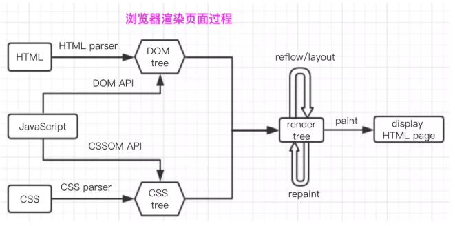

#### 防抖&节流

**防抖：**一个事件如果在指定延迟触发时机内持续执行，那么事件会一直被延迟，直到触发时机达到延迟时间才会执行

`实现原理：`在定时器内的函数如果还没被执行就又触发的话，我们就将该定时器清除掉

`使用情景：`类似百度的输入联想关键词的场景

```js
window.onload = function(){
        
        // 创建防抖函数
        // fn接收需要防抖的事件
        function debouce(fn){
            let timer = null //定时器标志，用于存放定时器返回值
            return function(){
                clearInterval(timer) //未执行期间点击将会使定时器销毁
                timer = setTimeout(()=>{
                    fn.call(this,arguments)
                },1500)
            }
        }
        // 需要进行防抖动的函数
        function handleBtn(){
            console.log('hello i fine thank')
        }

        // 进行防抖处理
        let btn = document.getElementById('btn')
        btn.onclick = debouce(handleBtn)
    }
```


**节流：**一个事件在指定时间内只会被执行一次

`实现原理：`通过判断一个标志的Boolean状态，来判断是否要执行事件

`使用情景`下拉列表获取数据

```js
  window.onload = function(){
        // 创建节流函数
        function throttle(fn){
            // 创建一个标记 当标记为true时标识当前函数可执行
            let flag = true
            return function(){
                // 如果不为true则return
                if(!flag){
                    return
                }
                // 标志为false防止被重复触发
                flag = false
                setTimeout(()=>{
                    fn.call(this,arguments)
                    console.log(this,"this")
                    console.log(arguments,"参数")
                    // 事件执行完毕后 告诉大家又可以执行啦
                    flag = true
                },1500)
            }
        }
        // 需要节流的函数
        function handleFn(){
            console.log('节流啊，节流啊')
        }

        let btn = document.getElementById('btn')
        btn.onclick = throttle(handleFn)
	}
```


#### 重绘&回流

**重绘(repaint)：** 当元素样式的改变不影响页面布局时，浏览器将使用重绘元素进行更新，此时只需UI层面的重新绘制，损耗较小

- 改变元素颜色
- 改变元素背景色

**回流(reflow)：**又称重排。当元素的尺寸、结构触发某些属性时，浏览器会重新渲染页面，此时浏览器需要重新计算，计算后还需要重新布局，是比较繁重的操作

- 页面初次渲染
- 浏览器窗口大小的改变
- 元素尺寸、内容、字体大小发生改变
- 操作DOM
- 激活CSS伪类（:hover...）

**如何避免大量使用重绘回流呢？**

- 避免频繁操作样式，可汇总后统一处理
- 尽量使用class进行样式修改，而不是直接操作样式
- 减少dom的操作，可使用字符串一次性插入


#### 浏览器解析URL

**解析过程**

- 用户输入URL地址
- 对URL地址进行DNS域名解析
- 建立TCP链接（三次握手）
- 浏览器发起HTTP请求报文
- 服务器返回HTTP响应报文
- 关闭TCP连接（四次挥手）
- 浏览器解析资源文档并渲染页面


#### 浏览器渲染页面

**渲染流程**

- 浏览器通过HTMLParser根据深度遍历的原则把HTML解析成DOM Tree
- 浏览器通过CSSParser将css解析成CSSOM Tree
- 浏览器将JS通过DOM API 或者 CSSOM API 将代码解析并运用到布局中去，按要求呈现响应效果
- 根据DOM Tree 和CSSOM  Tree 来构造 render Tree
- 回流 或者 重绘
- paint（描绘）：遍历render tree，并调用硬件图像API来绘制每个节点，最终展示为页面

