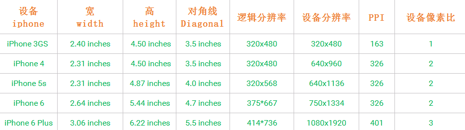

`为什么设计师给的设计稿总是640px或是750px`

`为什么我们拿到的640px和750px的设计稿在编码的时候都要除以2`

**pt：逻辑分辨率/逻辑像素**

- 即浏览器调试移动端是看到的各个手机像素


**px：物理分辨率/物理像素、设备像素**

- 它不能看做是一个长度单位，可以看做是一个点，即像素点
- px是数字显示设备上的最小单位，属于基本逻辑单位


**dpr：设备像素比**

- 即（ px / pt = dpr）iPhone6pxW  / iPhone6ptW = 2
- 人眼能分辨出的最大分辨率就是**@2x** 


**影响**

在dpr为2的屏幕下1px会变为2px...

```css
//解决
.border-1px {
  position: absolute;
  bottom:0;
    height: 1px;
    width: 100%;
    background:#dd1a21;
    -webkit-transform: scaleY(0.5);
    -webkit-transform-origin:0 0;
    overflow: hidden;
}
/* 2倍屏 */
@media only screen and (-webkit-min-device-pixel-ratio: 2.0) {
    .border-1px::after {
        -webkit-transform: scaleY(0.5);
        transform: scaleY(0.5);
    }
}

/* 3倍屏 */
@media only screen and (-webkit-min-device-pixel-ratio: 3.0) {
    .border-1px::after {
        -webkit-transform: scaleY(0.33);
        transform: scaleY(0.33);
    }
}
```


**ppi**：每英寸包含的像素点 


